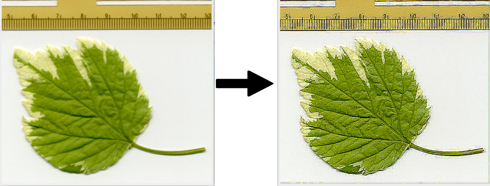

<p align="center">
  
</p>

<h1 align="center">Simple ImageJ Filters</h1>

## Table of Contents
- [Features](#featrues)
- [Example](#examples)
- [About ImageJ](#about-imagej)
- [Installation](#installation)

---

## Features
This plugin is created for the ImageJ image processing program. It has the following filters to manipulate images with:
- **Median Filter** - used to reduce noise in the image;
- **Contrast Filter** - used to lower the contrast of the image;
- **Sobel X Filter** - used to highlight the edges on the X axis;
- **Sobel Y Filter** - used to highlight the edges on the Y axis;

---

## Examples
### *Median Filter*


### *Contrast Filter*


### *Sobel X Filter*


### *Sobel Y Filter*


---

## About ImageJ
Everything about the ImageJ image processing program can be read [here](https://imagej.net/ij/docs/intro.html "ImageJ Introduction").

---

## Installation
To use this plugin a couple of things must be done in advance.
- Download the ImageJ image processing program on your OS. It can be done [here](https://imagej.nih.gov/ij/download.html "ImageJ Download");
- After installation of ImageJ navigate to the following directory:
```bash
    ../ImageJ/plugins/Examples
```
- Upload the *Simple_Filters.java* file into this directory;

When the above steps are completed open the ImageJ image processing program, this can be achieved by running the implemented script, which is found in the **ImageJ** folder:
```bash
    ./ImageJ
```

- After opening the program go to *Plugins* -> *Compile and Run...* :

- Then navigate to the folder where you saved the plugin;
- ImageJ should open the following window:  


